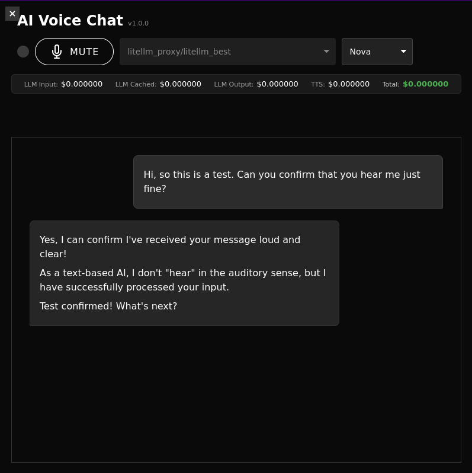

# Simple Voice Chat

This project provides a flexible voice chat interface that connects to various Speech-to-Text (STT), Large Language Model (LLM), and Text-to-Speech (TTS) services.



**Acknowledgement:** This project heavily relies on the fantastic [fastrtc](https://github.com/gradio-app/fastrtc) library, which simplifies real-time audio streaming over WebRTC and provided crucial examples for setting up the various supported backends, making this application possible.

## Motivation

This project aims to provide a versatile and cost-effective voice chat interface. While initially driven by the desire for alternatives to OpenAI's real-time voice API, it has evolved to offer multiple backend options, including direct integration with OpenAI's real-time services. This allows users to choose the best STT, LLM, and TTS combination for their needs, whether prioritizing cost, performance, self-hosting, or specific provider features.

## Features

*   🚀 **Multiple Backends:** The application supports three primary backend types for voice processing:
    *   **Classic Backend:** This is the most flexible option, offering a modular approach where you connect separate services for:
        *   🗣️ **STT (Speech-to-Text):** Supports API-based services like OpenAI Whisper or self-hosted engines such as [Speaches](https://github.com/speaches-ai/speaches) (which utilizes Faster Whisper).
        *   🧠 **LLM (Large Language Model):** Integrates with [LiteLLM](https://github.com/BerriAI/litellm), providing access to a vast array of models including OpenAI, Anthropic, Google, Mistral, Cohere, Azure, and local models run via services like [Ollama](https://ollama.com/), LiteLLM proxy, vLLM, and more.
        *   🔊 **TTS (Text-to-Speech):** Supports API-based services like OpenAI TTS or alternatives such as [Kokoro-FastAPI](https://github.com/remsky/Kokoro-FastAPI) (which can use [KokoroTTS](https://github.com/kokorotts/)).
        *   *This backend allows for a fully local setup if desired, using local STT, LLM (e.g., via Ollama), and TTS engines.*
    *   **OpenAI Backend:** Utilizes OpenAI's real-time voice API for a streamlined, all-in-one voice interaction experience, requiring an OpenAI API key. STT language and output voice can be configured.
    *   **Gemini Backend:** Leverages Google's Gemini Live Connect API for real-time voice interactions, requiring a Google Gemini API key. STT language and output voice can be configured.
*   ⚙️ **Highly Configurable:** Adjust backend type, STT/LLM/TTS hosts, ports, models, API keys, STT confidence thresholds (classic backend), TTS voice/speed (classic backend), system messages, STT language (all backends), and output voice (all backends) via CLI arguments or `.env` file.
*   🌐 **Web Interface:** Simple and responsive UI built with HTML, CSS, and JavaScript.
*   📊 **Cost Tracking:**
    *   **Classic Backend:** Real-time cost estimation for OpenAI LLM and TTS usage.
    *   **OpenAI Backend:** Real-time cost estimation based on token usage for the selected OpenAI real-time model.
    *   **Gemini Backend:** Real-time cost estimation based on token usage for the selected Gemini model.
*   ⚡ **Real-time Interaction:** Low-latency voice communication powered by [fastrtc](https://github.com/gradio-app/fastrtc) (WebRTC).
*   👂 **STT Confidence Filtering (Classic Backend):** Automatically reject low-confidence transcriptions based on configurable thresholds (no speech probability, average log probability, minimum word count).
*   🎤 **Dynamic Settings Adjustment:**
    *   **Classic Backend:** Change LLM model, TTS voice, TTS speed, and STT language on-the-fly.
    *   **OpenAI Backend:** Change STT language and output voice on-the-fly.
    *   **Gemini Backend:** Change STT language and output voice on-the-fly.
*   🔍 **Fuzzy Search:** Quickly find models and voices using fuzzy search in the UI dropdowns.
*   💬 **System Message Support:** Define a custom system message to guide the LLM's behavior.
*   📝 **Chat History Logging:** Automatically saves conversation history to timestamped JSON files.
*   🔄 **TTS Audio Replay (Classic Backend):** Replay the audio for any assistant message directly from the chat interface.
*   ⌨️ **Keyboard Shortcuts:** Control mute (M), clear chat (Ctrl+R), and toggle options (Shift+S) using keyboard shortcuts.
*   💓 **Connection Monitoring:** Uses a heartbeat mechanism to detect disconnected clients and potentially shut down the server.
*   🖥️ **Cross-Platform GUI:** Runs as a standalone desktop application using `pywebview` (default) or in a standard web browser (`--browser` flag). The application explicitly uses the QT backend for `pywebview` as the GTK backend lacks necessary WebRTC support.

## Known Issues

*   ⚠️ **Cost Calculation:** The cost calculation for the OpenAI real-time API is currently not functional. Documentation for this feature might be out of date in other sections.

## Installation


1.  Clone the repository:

    ```bash

    git clone https://github.com/thiswillbeyourgithub/simple_voice_chat

    cd simple_voice_chat

    ```

2.  Install the Python packages:

    ```bash

    uv pip install -e .

    ```

3.  (Optional) Configure services using environment variables. You can create a `.env` file based on the available options (see `--help` or `utils/env.py`).


## Usage


Run the main script using Python:


```bash
simple-voice-chat --help
```

The application will start a web server and attempt to open the interface in a dedicated window (or browser tab if `--browser` is specified).

### Running from a Python Script

You can also run the application directly from a Python script by importing and calling the `main` function from `simple_voice_chat.simple_voice_chat`. This allows you to pass arguments programmatically.

Here's an example:

```python
from simple_voice_chat.simple_voice_chat import main

if __name__ == "__main__":
    # Example arguments:
    # Replace these with your desired configuration
    args = [
        "--backend", "classic",
        "--llm-model", "gpt-4o",
        "--tts-voice", "alloy",
        "--stt-language", "en",
        "--browser",  # Launch in browser instead of pywebview GUI
        # Add other arguments as needed, like:
        # "--openai-api-key", "YOUR_OPENAI_KEY_HERE", # If using OpenAI backend
        # "--llm-api-key", "YOUR_LLM_KEY_HERE",    # If classic backend needs a key for LLM
        # "--stt-api-key", "YOUR_STT_KEY_HERE",    # If classic backend STT needs a key
        # "--tts-api-key", "YOUR_TTS_KEY_HERE",    # If classic backend TTS needs a key
    ]
    
    # The main function expects a list of strings, similar to sys.argv
    # It's decorated with @click.command(), so we call it with .main(args)
    # or by directly invoking it if click handles parsing internally when called this way.
    # For programmatic invocation with click, it's often easier to let click parse:
    import os
    # To ensure LiteLLM runs in production mode if not already set by the main script early enough
    os.environ['LITELLM_MODE'] = 'PRODUCTION' 
    
    # Call the click command directly
    # Note: click commands usually expect to be called as if from the command line.
    # To pass arguments programmatically to a click command, you typically invoke `main.main(args=args_list, standalone_mode=False)`.
    # However, since `main` is already a click command, we can try to directly invoke it.
    # If `main()` is defined as `def main(): @click.pass_context def cli(ctx, ...)` then `main(args)` works.
    # If `def main(...)` is the click command itself, it consumes args from sys.argv by default.
    # The `main` function in simple_voice_chat.py is a click command itself: `@click.command(...) def main(...)`
    # So, to run it programmatically as if from CLI:
    try:
        # sys.argv needs to be manipulated if click is to parse it automatically,
        # or use the programmatic API if available.
        # The simplest way with click
        main.main(args=args, standalone_mode=False) 
    except SystemExit as e:
        # Click commands often call sys.exit(). We can catch this if running in a script.
        print(f"Application exited with status: {e.code}")

```

When calling programmatically, `main.main(args=your_list_of_args, standalone_mode=False)` is the recommended way to invoke a Click command and pass arguments. The `standalone_mode=False` flag prevents Click from trying to exit the entire Python interpreter.

You can find all available command-line arguments and their corresponding environment variables by running `simple-voice-chat --help`.

You can choose the backend using the `--backend` option:
*   `--backend classic` (default): Uses separate STT, LLM, and TTS services.
*   `--backend openai`: Uses OpenAI's real-time voice API. Requires `--openai-api-key`.
*   `--backend gemini`: Uses Google's Gemini Live Connect API. Requires `--gemini-api-key`.

**For a detailed list of all configuration options, please use the `--help` flag:**

```bash
simple-voice-chat --help
```

This will provide the most up-to-date information on available arguments and their corresponding environment variables, including options specific to each backend.

## Configuration Details

Simple Voice Chat offers a flexible configuration system. Settings can be managed through command-line arguments or by creating a `.env` file in the project's root directory.

**Priority:** Command-line arguments take precedence over environment variables defined in the `.env` file. Environment variables loaded via `.env` will be available for `click` options that specify an `envvar`.

**Finding All Options:**
*   **Command-Line Help:** The most comprehensive list of all available settings, their default values, and corresponding environment variable names can be found by running:
    ```bash
    simple-voice-chat --help
    ```
*   **Environment Variable Definitions:** You can also inspect the `simple_voice_chat/utils/env.py` file to see how environment variables are loaded as defaults (e.g., `LLM_MODEL_ENV = os.getenv("LLM_MODEL", ...)`). The `envvar` parameter in `click` options in `simple_voice_chat.py` also shows which environment variables are directly checked.

**Common Configuration Areas:**

*   **Backend Selection:** Choose between `classic`, `openai`, or `gemini` backends using the `--backend` command-line argument. (Note: This specific option is primarily controlled via the CLI argument; most other options can also be set via environment variables as detailed in `--help`.)
*   **API Keys:** Provide necessary API keys for services like OpenAI, Gemini, or other LLM/STT/TTS providers (e.g., set `OPENAI_API_KEY="..."`, `GEMINI_API_KEY="..."`, `LLM_API_KEY="..."` in your `.env` file).
*   **Service Endpoints (Classic Backend):** Configure host and port for your STT, LLM, and TTS services (e.g., `STT_HOST="localhost"`, `LLM_PORT="8080"`).
*   **Models and Voices:**
    *   **Classic Backend:** `LLM_MODEL`, `TTS_VOICE`.
    *   **OpenAI Backend:** `OPENAI_REALTIME_MODEL`, `OPENAI_REALTIME_VOICE`.
    *   **Gemini Backend:** `GEMINI_MODEL`, `GEMINI_VOICE`.
*   **STT Behavior:** Adjust STT language (e.g., `STT_LANGUAGE="en"`). For the `classic` backend, configure confidence thresholds (e.g., `STT_NO_SPEECH_PROB_THRESHOLD="0.6"`, `STT_AVG_LOGPROB_THRESHOLD="-0.7"`).
*   **TTS Behavior (Classic Backend):** Control TTS speed (e.g., `TTS_SPEED="1.1"`) and specify acronyms to preserve (e.g., `TTS_ACRONYM_PRESERVE_LIST="AI,TTS,ASAP"`).
*   **Gemini Backend Specifics:** Configure context window compression with `GEMINI_CONTEXT_WINDOW_COMPRESSION_THRESHOLD`.
*   **Application Behavior:** Set the `SYSTEM_MESSAGE="You are a concise assistant."`, configure the application port (e.g., `APP_PORT="7860"`), choose to launch in browser mode (using the `--browser` flag), and disable client-disconnect-based server shutdown with `DISABLE_HEARTBEAT="True"`.

**Example `.env` file:**

```env
# .env Example - uncomment and modify lines as needed

# General Application Settings
# APP_PORT=7861
SYSTEM_MESSAGE="You are a helpful and friendly voice assistant."
STT_LANGUAGE="en" # Language for Speech-to-Text (e.g., "en", "es", "fr"). Affects all backends.
# DISABLE_HEARTBEAT="False" # Set to "True" to prevent server shutdown on client disconnect.

# ---- Backend Specific Configuration ----
# Choose ONE backend via the --backend CLI option ("classic", "openai", or "gemini").
# The environment variables below are relevant based on that choice.

# ======= OpenAI Backend =======
# Used if --backend=openai
OPENAI_API_KEY="sk-yourOpenAIapiKeyGoesHereIfUsingOpenAIBackend"
OPENAI_REALTIME_MODEL="gpt-4o-mini-realtime-preview" # e.g., gpt-4o-realtime-preview, gpt-4o-mini-realtime-preview
OPENAI_REALTIME_VOICE="alloy"                     # e.g., alloy, echo, fable, onyx, nova, shimmer, ash

# ======= Gemini Backend =======
# Used if --backend=gemini
# GEMINI_API_KEY="yourGoogleGeminiApiKeyGoesHere"
# GEMINI_MODEL="gemini-2.0-flash-live-001" # e.g., gemini-2.0-flash-live-001
# GEMINI_VOICE="Puck"                      # e.g., Puck, Charon, Kore, Fenrir, Aoede
# GEMINI_CONTEXT_WINDOW_COMPRESSION_THRESHOLD="16000" # Default threshold for sliding window context compression

# ======= Classic Backend =======
# Used if --backend=classic (or if no --backend is specified, as it's the default)

# --- LLM Configuration (Classic Backend) ---
# LLM_HOST="localhost"               # Optional: Host for LiteLLM proxy
# LLM_PORT="8000"                    # Optional: Port for LiteLLM proxy
LLM_MODEL="openrouter/google/gemini-flash-1.5" # Default LLM model (e.g., "gpt-4o", "ollama/llama3")
LLM_API_KEY=""                     # Optional: API key for your LLM provider or LiteLLM proxy

# --- STT Configuration (Classic Backend) ---
# Defaults to OpenAI STT (api.openai.com:443, model whisper-1)
# STT_HOST="api.openai.com"
# STT_PORT="443"
# STT_MODEL="whisper-1"
# STT_API_KEY="sk-yourOpenAIapiKeyGoesHereIfUsingOpenAI_STT_forClassicBackend" # REQUIRED if using OpenAI STT

# Example for a local STT server like Speaches:
# STT_HOST="localhost"
# STT_PORT="8088" # Default Speaches port
# STT_MODEL="distil-whisper/distil-large-v2" # Example model name for Speaches
# STT_API_KEY="" # If your local STT server requires an API key

# STT Confidence Thresholds (Classic Backend)
# STT_NO_SPEECH_PROB_THRESHOLD="0.6"
# STT_AVG_LOGPROB_THRESHOLD="-0.7"
# STT_MIN_WORDS_THRESHOLD="5"

# --- TTS Configuration (Classic Backend) ---
# Defaults to OpenAI TTS (api.openai.com:443, model tts-1, voice ash)
# TTS_HOST="api.openai.com"
# TTS_PORT="443"
# TTS_MODEL="tts-1" # e.g., tts-1, tts-1-hd
# TTS_VOICE="ash"   # e.g., alloy, echo, fable, onyx, nova, shimmer, ash
# TTS_API_KEY="sk-yourOpenAIapiKeyGoesHereIfUsingOpenAI_TTS_forClassicBackend" # REQUIRED if using OpenAI TTS
# TTS_SPEED="1.0"   # TTS speed (0.1 to 4.0)

# Example for a local TTS server like Kokoro-FastAPI:
# TTS_HOST="localhost"
# TTS_PORT="8002" # Default Kokoro-FastAPI port
# TTS_MODEL="kokoro-multiple-toyunda-en" # Example model name for Kokoro
# TTS_VOICE="ToyundaDesktop" # Example voice for Kokoro
# TTS_API_KEY="" # If your local TTS server requires an API key
# TTS_SPEED="1.2"
# TTS_ACRONYM_PRESERVE_LIST="AI,TTS,LLM,ASAP" # Comma-separated list of acronyms for Kokoro TTS
```

Remember to remove or comment out settings that are not relevant to your chosen backend or setup. The `simple-voice-chat --help` output is your best reference for all available options and their corresponding environment variables.

---


*This README was generated with assistance from [aider.chat](https://aider.chat).*
